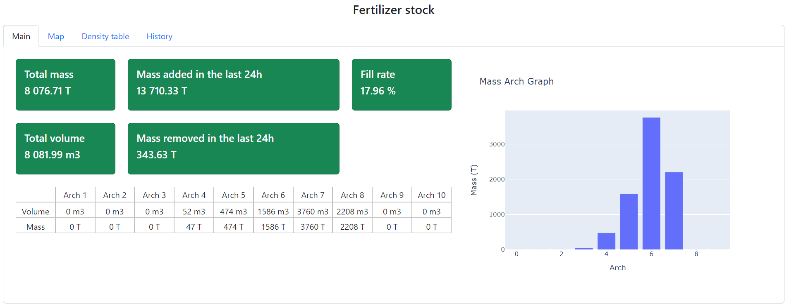
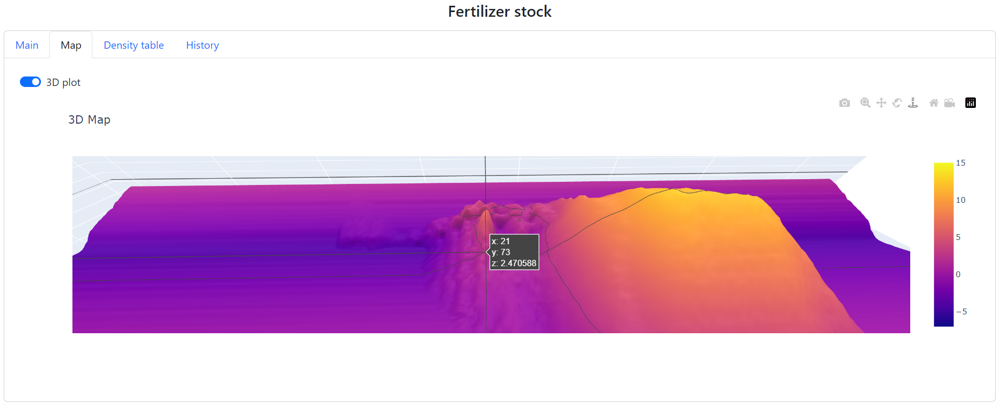
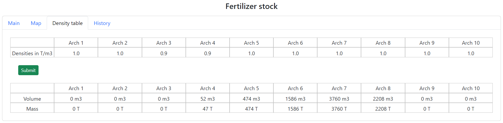
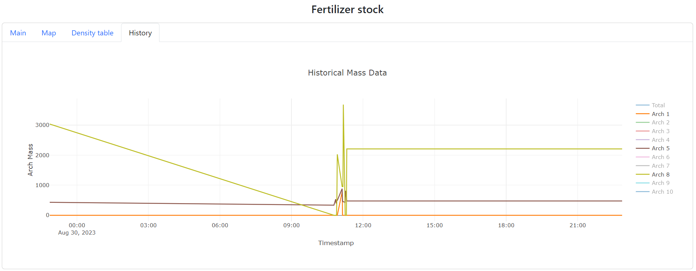

# Inventory Estimation via Neural Network

## Overview
This repository stems from a mission to survey a big company's fertilizer inventory. It features an algorithm for inventory prediction using level sensors, which processes data to predict 3D shapes of fertilizer piles. The repository also includes front-end and back-end components for data reception and result display on a web page.

## Fertilizer Inventory
The trolley is responsible for pouring the freshly produced fertilizer into the hangar. The scraper is designed to remove the fertilizer from the hangar. The fertilizer is stored in piles.
 |  |  
:---:|:---:|:---:
Trolley|Scraper|Scraper with piles of fertilizer

## Adopted Solution for Inventory Estimation

The predictive models are built upon historical data generated through a 3D scan of the area.

### Step 1: Prediction of Transversal Profile

The initial step involves predicting the transversal profile of the pile using data from the level sensors. Choose between two transversal models:

- **NNM Neural Network Model**: Utilizing a pretrained model stored in `utils/transversal_models/NNM_gratteur.pth`.
- **DMM Data Matching Model**: This model seeks to find the optimal match between real-time data and historical data.

### Step 2: Prediction of 3D Pile Shape

The next step is to predict the 3D shape of the pile by filtering out irrelevant profiles and predicting the space between valid ones. Choose between four filters:

- **NNF Nearest Neighbor Filter**: Predicts unknown values based on the nearest transversal profile.
- **FAF1 Friction Angle Filter with 1 Axis**: Exploits the friction angle along one axis of the fertilizer for prediction.
- **FAF1 Friction Angle Filter with 1 Axis, 2 Lines**: Utilizes the friction angle along one axis but in two different lines of the fertilizer for prediction.
- **DFF DeepFill Filter**: A generative adversarial network inspired by the repository found at "https://github.com/nipponjo/deepfillv2-pytorch". The pretrained model is stored in `utils/filters/model_DFF/pretrained_self_trained.zip`.

## Prerequisites

Before you begin, ensure you have met the following requirements:

- Python installed
- Required Python packages:
  - Dash
  - Dash Table
  - Plotly
  - Numpy
  - Watchdog
  - Pandas
  - Schedule
- Extract the contents of the archive located at `utils/filters/model_DFF/pretrained_self_trained.zip` before running the application.

All parameters of the predicting models, Hangar dimensions, etc., are configurable in `config.yaml`.

## Backend
The file that triggers the predicting process is the file `data\sensors\sensors.csv`. Once the file is updated, the backend reads the data inside and begins processing.

The diagram below shows how the software is working under the hood.

## Frontend

The dashboard consists of 4 tabs:

**Main Tab:** The figure below displays crucial information, including the total volume of fertilizer in the hangar, total mass, mass in each arch, stored mass, loaded mass in the last 24 hours, and the percentage filled compared to the total capacity of the hangar.

**Map Tab:** The figure below shows a 2D heatmap of the map and a 3D map of the stock.

**Densities Tab:** The figure below contains an editable table for manually entering the fertilizer density.

**History Tab:** The figure below includes a graph displaying the stock in each arch over time. This tab is crucial for tracking the historical evolution of the stock's state.

